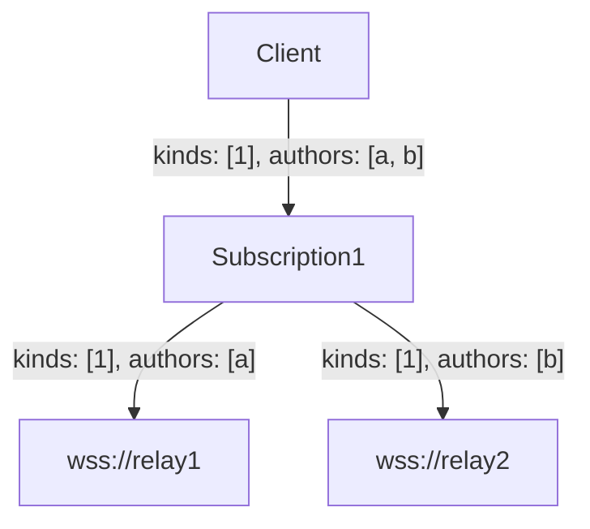
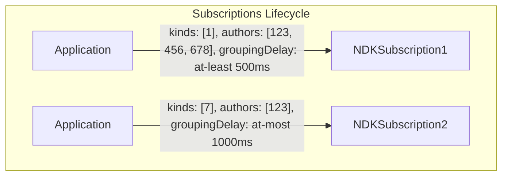
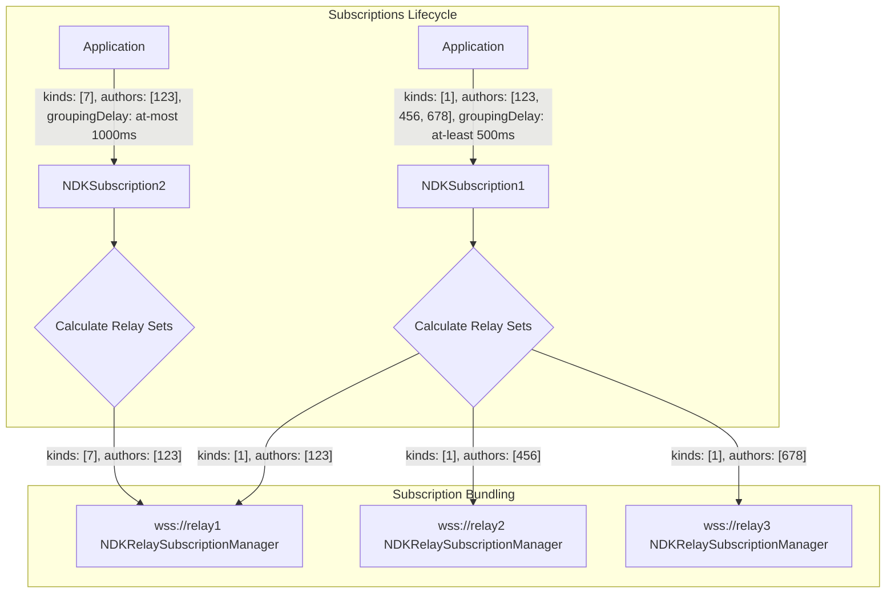
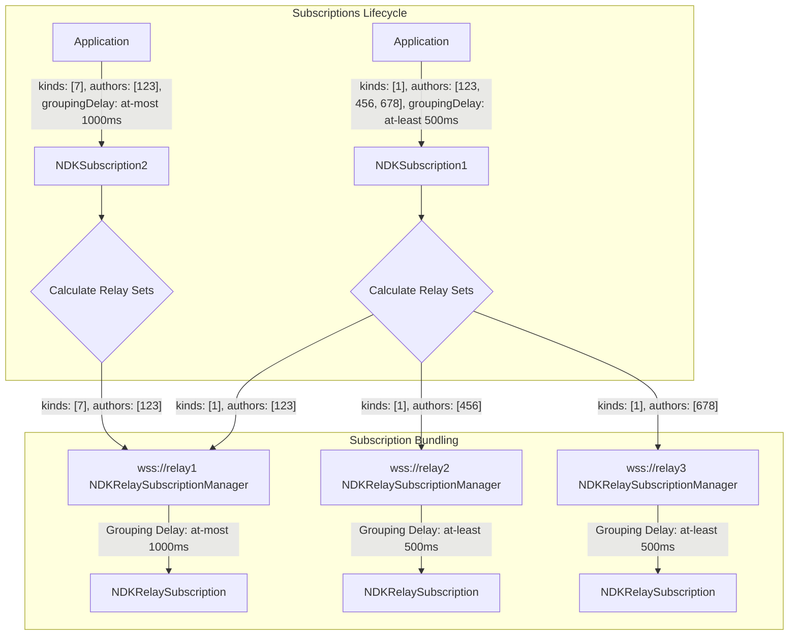
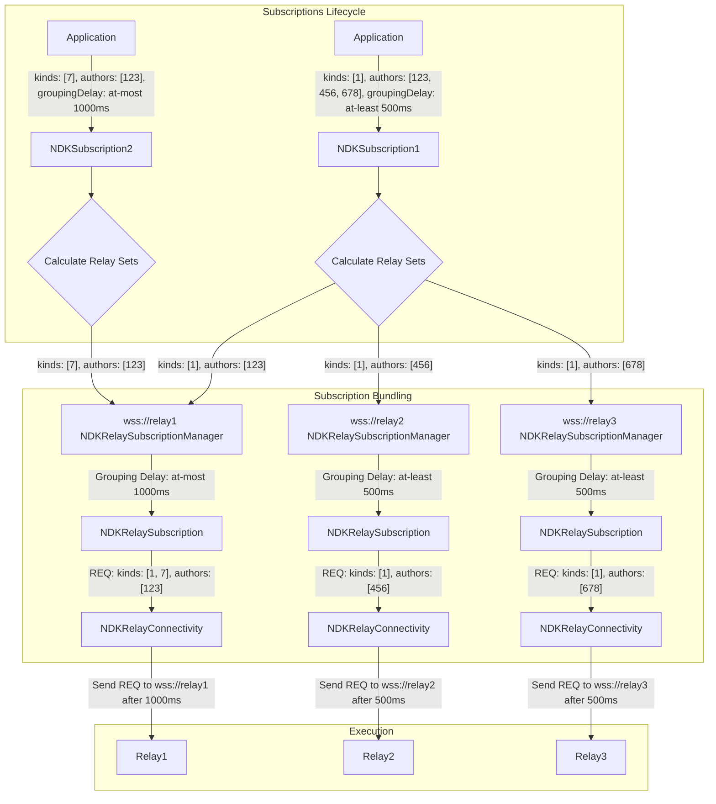
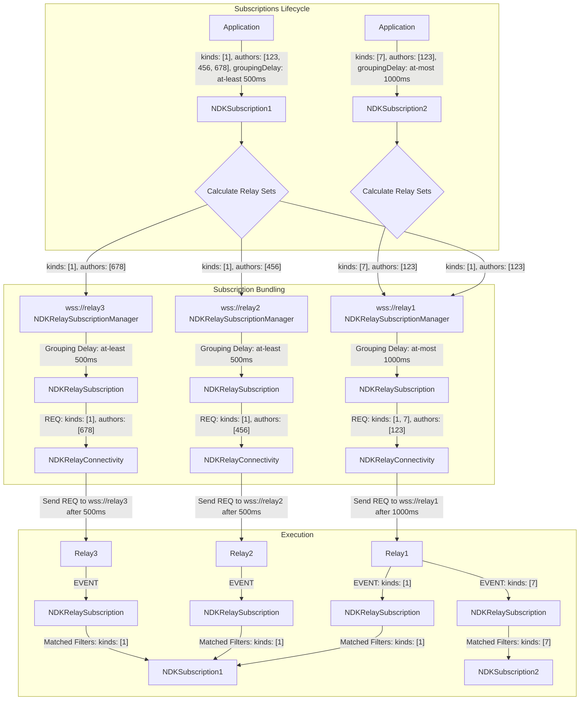

# NDK Main Documentation

# NDK


NDK is a [nostr](<[url](https://github.com/nostr-protocol/nostr)>) development kit that makes the experience of building Nostr-related applications, whether they are relays, clients, or anything in between, better, more reliable and overall nicer to work with than existing solutions.

## NDK Objectives

1. The core goal of NDK is to improve the decentralization of Nostr via intelligent conventions and data discovery features without depending on any one central point of coordination (such as large relays or centralized search providers).
2. NDK team aims to have new to nostr devs get set up, and reading a NIP-01 event within 10 minutes.
3. NDK's objective is to serve prospective, and current nostr devs as clients. If you have friction with the NDK developer experience, please open issues, and ask for help from the NDK team! Devs are encouraged to search through existing, and/or create new github issues when experiencing friction with NDK.

## Installation

```sh
npm add @nostr-dev-kit/ndk
```

## Debugging

NDK uses the `debug` package to assist in understanding what's happening behind the hood. If you are building a package
that runs on the server define the `DEBUG` envionment variable like

```
export DEBUG='ndk:*'
```

or in the browser enable it by writing in the DevTools console

```
localStorage.debug = 'ndk:*'
```

## Support

-   [documentation](https://ndk.fyi/docs)

## Features

-   [x] NIP-01
-   [x] Caching adapters
    -   Server-side
        -   [x] [Redis](https://github.com/nostr-dev-kit/ndk-cache-redis)
        -   [ ] In-memory
    -   Client-side
        -   [ ] LocalStorage
        -   [x] IndexD ([Dexie](https://github.com/nostr-dev-kit/ndk-cache-dexie))
-   [~] NIP-04: Encryption support
-   [x] NIP-18: Repost
-   [ ] ~~NIP-26~~ Won't add / NIP-26 is dead
-   [x] NIP-42: Relay authentication
-   [x] NIP-57: Zaps
    -   [x] LUD06
    -   [x] LUD16
-   [ ] NIP-65: Contacts' Relay list
-   [x] NIP-89: Application Handlers
-   [x] NIP-90: Data Vending Machines
-   Subscription Management
    -   [x] Auto-grouping queries
    -   [x] Auto-closing subscriptions
-   Signing Adapters
    -   [x] Private key
    -   [x] NIP-07
    -   [!] ~~NIP-26~~ Won't add / NIP-26 is dead
    -   [x] NIP-46
        -   [x] Permission tokens
        -   [x] OAuth flow
-   Relay discovery
    -   [x] Outbox-model (NIP-65)
    -   [ ] Implicit relays discovery following pubkey usage
    -   [ ] Implicit relays discovery following `t` tag usage
    -   [x] Explicit relays blacklist
-   [ ] nostr-tools/SimplePool drop-in replacement interface
-   [x] NIP-47: Nostr Wallet Connect
-   [x] NIP-96: Media Uploads
    -   [x] XMLHttpRequest (for progress reporting)
    -   [x] Fetch API

## Real-world uses of NDK

See [REFERENCES.md](./REFERENCES.md) for a list of projects using NDK to see how others are using it.

## Instantiate an NDK instance

You can pass an object with several options to a newly created instance of NDK.

-   `explicitRelayUrls` – an array of relay URLs.
-   `signer` - an instance of a [signer](#signers).
-   `cacheAdapter` - an instance of a [Cache Adapter](#caching)
-   `debug` - Debug instance to use for logging. Defaults to `debug("ndk")`.

```ts
// Import the package
import NDK from "@nostr-dev-kit/ndk";
import "websocket-polyfill";

// Create a new NDK instance with explicit relays
const ndk = new NDK({
    explicitRelayUrls: ["wss://a.relay", "wss://another.relay"],
});
```

If the signer implements the `getRelays()` method, NDK will use the relays returned by that method as the explicit relays.

```ts
// Import the package
import NDK, { NDKNip07Signer } from "@nostr-dev-kit/ndk";

// Create a new NDK instance with just a signer (provided the signer implements the getRelays() method)
const nip07signer = new NDKNip07Signer();
const ndk = new NDK({ signer: nip07signer });
```

Note: In normal client use, it's best practice to instantiate NDK as a singleton class. [See more below](#architecture-decisions--suggestions).

## Connecting

After you've instatiated NDK, you need to tell it to connect before you'll be able to interact with any relays.

```ts
// Import the package
import NDK from "@nostr-dev-kit/ndk";

// Create a new NDK instance with explicit relays
const ndk = new NDK({
    explicitRelayUrls: ["wss://a.relay", "wss://another.relay"],
});
// Now connect to specified relays
await ndk.connect();
```

## Signers

NDK uses signers _optionally_ passed in to sign events. Note that it is possible to use NDK without signing events (e.g. [to get someone's profile](https://github.com/nostr-dev-kit/ndk-cli/blob/master/src/commands/profile.ts)).

Signing adapters can be passed in when NDK is instantiated or later during runtime.

### Using a NIP-07 browser extension (e.g. Alby, nos2x)

Instatiate NDK with a NIP-07 signer

```ts
// Import the package, NIP-07 signer and NDK event
import NDK, { NDKEvent, NDKNip07Signer } from "@nostr-dev-kit/ndk";

const nip07signer = new NDKNip07Signer();
const ndk = new NDK({ signer: nip07signer });
```

NDK can now ask for permission, via their NIP-07 extension, to...

**Read the user's public key**

```ts
nip07signer.user().then(async (user) => {
    if (!!user.npub) {
        console.log("Permission granted to read their public key:", user.npub);
    }
});
```

**Sign & publish events**

```ts
const ndkEvent = new NDKEvent(ndk);
ndkEvent.kind = 1;
ndkEvent.content = "Hello, world!";
ndkEvent.publish(); // This will trigger the extension to ask the user to confirm signing.
```

<!-- ### Signing Events via NIP-46

```ts
const signingAdapter = new NDK.RemoteSignerAdapter();
const ndk = new NDK({ signingAdapter });
const event = ndk.event();
event.kind = 0;
event.content = "This event is signed via NIP-46.";
await event.publish();
``` -->

## Caching

NDK provides database-agnostic caching functionality out-of-the-box to improve the performance of your application and reduce load on relays.

NDK will eventually allow you to use multiple caches simultaneously and allow for selective storage of data in the cache store that makes the most sense for your application.

### Where to look is more important that long-term storage

The most important data to cache is _where_ a user or note might be found. UX suffers profoundly when this type of data cannot be found. By design, the Nostr protocol leaves breadcrumbs of where a user or note might be found and NDK does it's best to store this data automatically and use it when you query for events.

### Instantiating and using a cache adapter

```ts
const redisAdapter = new RedisAdapter(redisUrl);
const ndk = new NDK({ cacheAdapter: redisAdapter });
```

## Groupable queries

Clients often need to load data (e.g. profile data) from individual components at once (e.g. initial page render). This typically causes multiple subscriptions to be submitted fetching the same information and causing poor performance or getting rate-limited/maxed out by relays.

NDK implements a convenient subscription model, _buffered queries_, where a named subscription will be created after a customizable amount of time, so that multiple components can append queries.

```ts
// Component 1
ndk.subscribe({ kinds: [0], authors: ["pubkey-1"] });

// Component 2
ndk.subscribe({ kinds: [0], authors: ["pubkey-2"] });
```

In this example, NDK will wait 100ms (default `groupableDelay`) before creating a subscription with the filter:

```ts
{kinds: [0], authors: ['pubkey-1', 'pubkey-2'] }
```

## Intelligent relay selection

When a client submits a request through NDK, NDK will calculate which relays are most likely able to satisfy this request.

Queries submitted by the client might be broken into different queries if NDK computes different relays.

For example, say npub-A follows npub-B and npub-C. If the NDK client uses:

```ts
const ndk = new NDK({ explicitRelayUrls: ["wss://nos.lol"] });
const npubA = ndk.getUser("npub-A");
const feedEvents = await npubA.feed();
```

This would result in the following request:

```json
{ "kinds": [1], "authors": ["npub-B", "npub-C"] }
```

But if NDK has observed that `npub-B` tends to write to `wss://userb.xyz` and
`npub-C` tends to write to `wss://userc.io`, NDK will instead send the following queries.

```json
// to npub-A's explicit relay wss://nos.lol *if* npub-B and npub-C have been seen on that relay
{ "kinds": [1], "authors": [ "npub-B", "npub-C" ] }

// to wss://userb.xyz
{ "kinds": [1], "authors": [ "npub-B" ] }

// to wss://userc.io
{ "kinds": [1], "authors": [ "npub-C" ] }
```

## Auto-closing subscriptions

Often, clients need to fetch data but don't need to maintain an open connection to the relay. This is true of profile metadata requests especially.
_NDK defaults to having the `closeOnEose` flag set to `false`; if you want your subscription to close after `EOSE`, you should set it to `true`._

-   The `closeOnEose` flag will make the connection close immediately after EOSE is seen.

```ts
ndk.subscribe({ kinds: [0], authors: ["..."] }, { closeOnEose: true });
```

## Convenience methods

NDK implements several conveience methods for common queries.

### Instantiate a user by npub or hex pubkey

This is a handy method for instantiating a new `NDKUser` and associating the current NDK instance with that user for future calls.

```ts
const pablo = ndk.getUser({
    npub: "npub1l2vyh47mk2p0qlsku7hg0vn29faehy9hy34ygaclpn66ukqp3afqutajft",
});

const jeff = ndk.getUser({
    pubkey: "1739d937dc8c0c7370aa27585938c119e25c41f6c441a5d34c6d38503e3136ef",
});
```

### Fetch a user's profile and publish updates

You can easily fetch a user's profile data from `kind:0` events on relays. Calling `.fetchProfile()` will update the `profile` attribute on the user object instead of returning the profile directly. NDK then makes it trivial to update values and publish those updates back to relays.

```ts
const pablo = ndk.getUser({
    npub: "npub1l2vyh47mk2p0qlsku7hg0vn29faehy9hy34ygaclpn66ukqp3afqutajft",
});
await pablo.fetchProfile();

const pabloFullProfile = pablo.profile;

pablo.profile.name = "Pablo";
await pablo.publish(); // Triggers signing via signer
```

### Finding a single event or all events matching a filter

You can fetch the first event or all events that match a given set of filters.

```ts
// Create a filter
const filter: NDKFilter = { kinds: [1], authors: [hexpubkey1, hexpubkey2] };

// Will return only the first event
event = await ndk.fetchEvent(filter);

// Will return all found events
events = await ndk.fetchEvents(filter);
```

### Creating & publishing events

```ts
const ndk = new NDK({ explicitRelayUrls, signer });
const event = new NDKEvent(ndk);
event.kind = 1;
event.content = "PV Nostr! 🤙🏼";
await ndk.publish(event);
```

### Reacting to an event

```ts
// Find the first event from @jack, and react/like it.
const jack = await ndk.getUserFromNip05("jack@cashapp.com");
const event = await ndk.fetchEvent({ authors: [jack.pubkey] })[0];
await event.react("🤙");
```

### Zap an event

```ts
// Find the first event from @jack, and zap it.
const jack = await ndk.getUserFromNip05("jack@cashapp.com");
const event = await ndk.fetchEvent({ authors: [jack.pubkey] })[0];
await ndk.zap(event, 1337, "Zapping your post!"); // Returns a bolt11 payment request
```

## Architecture decisions & suggestions

-   Users of NDK should instantiate a single NDK instance.
-   That instance tracks state with all relays connected, explicit and otherwise.
-   All relays are tracked in a single pool that handles connection errors/reconnection logic.
-   RelaySets are assembled ad-hoc as needed depending on the queries set, although some RelaySets might be long-lasting, like the `explicitRelayUrls` specified by the user.
-   RelaySets are always a subset of the pool of all available relays.

# NDK Svelte Documentation

# ndk-svelte

This package provides convenience functionalities to make usage of NDK with Svelte nicer.

## Install

```
pnpm add @nostr-dev-kit/ndk-svelte
```

## Store subscriptions

NDK-svelte provides Svelte Store subscriptions so your components can have simple reactivity
when events arrive.

Events in the store will appear in a set ordered by `created_at`.

```typescript
import NDKSvelte from "@nostr-dev-kit/ndk-svelte";

const ndk = new NDKSvelte({
    explicitRelayUrls: ["wss://relay.f7z.io"],
});
```

```typescript
// in your components
<script lang="ts">
    const highlights = $ndk.storeSubscribe(
        { kinds: [9802 as number] }, // Highlights
        { closeOnEose: false },
        NDKHighlight // Wrap all results in NDKHighlight
    );

    const nostrHighlightsAndReposts = $ndk.storeSubscribeWithReposts(
        { kinds: [9802], "#t": ["nostr"] }, // filter for Highlights with Nostr
        { kinds: [16], "#k": ["9802"], "#t": ["nostr"] }, // filter for Reposts of Highlights with Nostr
        { closeOnEose: false },
        NDKHighlight // Wrap all results in NDKHighlight
    );
    { closeOnEose: false }, NDKNote);

    onDestroy(() => {
        // Close the nostr subscription when the component is destroyed
        highlights.unsubscribe();
    });
</script>

<p>
    {$highlights.length} highlights seen
</p>

<p>
    {$nostrHighlightsAndReposts.length} nostr highlights (including reposts)
</p>
```

## Reference Counting with ref/unref

NDK-svelte introduces a reference counting mechanism through the ref and unref methods on the stores. This system is particularly useful for optimizing the lifecycle of subscriptions in components that might be frequently mounted and unmounted.

### Benefits:

-   **Optimized Lifecycle**: Instead of starting a new subscription every time a component mounts, and ending it when it unmounts, you can reuse an existing subscription if another component is already using it.

-   **Resource Efficiency**: By preventing redundant subscriptions, you save both network bandwidth and processing power.

-   **Synchronization**: Ensures that multiple components referencing the same data are synchronized with a single data source.

### How to use:

Whenever you subscribe to a store in a component, call ref to increment the reference count:

```typescript
// lib/stores/highlightsStore.ts
const highlightsStore = $ndk.storeSubscribe(..., { autoStart: false } });

// component 1
<script>
import { highlightsStore } from '$stores/highlightsStore.ts';
import { onDestroy } from 'svelte';
highlightsStore.ref();

onDestroy(() => {
    highlightsStore.unref();
});
</script>

{$highlightsStore.length} highlights seen
```

You can mount this component as many times as you want, and the subscription will only be started once. When the last component unmounts, the subscription will be terminated.

# Notes

If you are interested in NDK and Svelte you might want to checkout the
[ndk-svelte-components](https://github.com/nostr-dev-kit/ndk-svelte-components) package
which provides some components to make it easier to build nostr apps with Svelte.

# Authors

-   [@pablof7z](https://njump.me/npub1l2vyh47mk2p0qlsku7hg0vn29faehy9hy34ygaclpn66ukqp3afqutajft)

# NDK Svelte Components Documentation

# ndk-svelte-components

Reusable Svelte components.

## Installation

```
# With npm
npm add @nostr-dev-kit/ndk-svelte-components

# With pnpm
pnpm add @nostr-dev-kit/ndk-svelte-components

# With yarn
yarn install @nostr-dev-kit/ndk-svelte-components
```

## Storybook

This project uses `pnpm` to manage dependencies.

```
git clone https://github.com/nostr-dev-kit/ndk-svelte-components
cd ndk-svelte-components
pnpm i
pnpm run storybook
```

# Components

## Event

### `<EventCard>`

Displays a card with formatted event content.

### `<EventContent>`

Formats the content of an event for an `EventCard`. Currently supports:

-   kind 1 events
-   Embedded kind 1 events in other kind 1 events

## User

### `<Avatar>`

Displays a user's avatar

### `<Name>`

Displays a user's name

## Relay

### `<RelayList ndk />`

Displays a list of relays the NDK instance is connected to, along with information about active subscriptions and connectivity stats.


# License

MIT

# Author

-   pablof7z ([npub1l2vyh47mk2p0qlsku7hg0vn29faehy9hy34ygaclpn66ukqp3afqutajft](https://primal.net/pablof7z))
-   jeffg ([npub1zuuajd7u3sx8xu92yav9jwxpr839cs0kc3q6t56vd5u9q033xmhsk6c2uc](https://primal.net/jeffg))

# NDK Subscriptions Internals Documentation

# Subscriptions Lifecycle
When an application creates a subscription a lot of things happen under the hood.

Say we want to see `kind:1` events from pubkeys `123`, `456`, and `678`.

```ts
const subscription = ndk.subscribe({ kinds: [1], authors: [ "123", "456", "678" ]})
```

Since the application level didn't explicitly provide a relay-set, which is the most common use case, NDK will calculate a relay set based on the outbox model plus a variety of some other factors.

So the first thing we'll do before talking to relays is, decide to *which* relays we should talk to.

The `calculateRelaySetsFromFilters` function will take care of this and provide us with a map of relay URLs and filters for each relay.

This means that the query, as specified by the client might be broken into distinct queries specialized for the different relays.

For example, if we have 3 relays, and the query is for `kind:1` events from pubkeys `a` and `b`, the `calculateRelaySetsFromFilters` function might return something like this:

```ts
{
  "wss://relay1": { kinds: [1], authors: [ "a" ] },
  "wss://relay2": { kinds: [1], authors: [ "b" ] },
}
```



## Subscription bundling
Once the subscription has been split into the filters each relay should receive, the filters are sent to the individual `NDKRelay`'s `NDKRelaySubscriptionManager` instances.

`NDKRelaySubscriptionManager` is responsible for keeping track of the active and scheduled subscriptions that are pending to be executed within an individual relay.

This is an important aspect to consider:

> `NDKSubscription` have a different lifecycle than `NDKRelaySubscription`. For example, a subscription that is set to close after EOSE might still be active within the `NDKSubscription` lifecycle, but it might have been already been closed within the `NDKRelaySubscription` lifecycle, since NDK attempts to keep the minimum amount of open subscriptions at any given time.

## NDKRelaySubscription
Most NDK subscriptions (by default) are set to be executed with a grouping delay. Will cover what this looks like in practice later, but for now, let's understand than when the `NDKRelaySubscriptionManager` receives an order, it might not execute it right away.

The different filters that can be grouped together (thus executed as a single `REQ` within a relay) are grouped within the same `NDKRelaySubscription` instance and the execution scheduler is computed respecting what each individual `NDKSubscription` has requested.

(For example, if a subscription with a `groupingDelay` of `at-least` 500 millisecond has been grouped with another subscription with a `groupingDelay` of `at-least` 1000 milliseconds, the `NDKRelaySubscriptionManager` will wait 1000 ms before sending the `REQ` to this particular relay).

### Execution
Once the filter is executed at the relay level, the `REQ` is submitted into that relay's `NDKRelayConnectivity` instance, which will take care of monitoring for responses for this particular REQ and communicate them back into the `NDKRelaySubscription` instance.

Each `EVENT` that comes back as a response to our `REQ` within this `NDKRelaySubscription` instance is then compared with the filters of each `NDKSubscription` that has been grouped and if it matches, it is sent back to the `NDKSubscription` instance.


# Example

If an application requests `kind:1` of pubkeys `123`, `456`, and `789`. It creates an `NDKSubscription`:

```ts
ndk.subscribe({ kinds: [1], authors: [ "123", "456", "789" ]}, { groupableDelay: 500, groupableDelayType: 'at-least' })
// results in NDKSubscription1 with filters { kinds: [1], authors: [ "123", "456", "789" ] }
```

Some other part of the application requests a kind:7 from pubkey `123` at the same time.

```ts
ndk.subscribe({ kinds: [7], authors: [ "123" ]}, { groupableDelay: 500, groupableDelayType: 'at-most' })
// results in NDKSubscription2 with filters { kinds: [7], authors: [ "123" ] }
```



Both subscriptions have their relayset calculated by NDK and, the resulting filters are sent into the `NDKRelaySubscriptionManager`, which will decide what, and how filters can be grouped.



The `NDKRelaySubscriptionManager` will create `NDKRelaySubscription` instances, or add filters to them if `NDKRelaySubscription` with the same filter fingerprint exists.



Each individual `NDKRelaySubscription` computes the execution schedule of the filters it has received and sends them to the `NDKRelayConnectivity` instance, which in turns sends the `REQ` to the relay.



As the events come from the relays, `NDKRelayConnectivity` will send them back to the `NDKRelaySubscription` instance, which will compare the event with the filters of the `NDKSubscription` instances that have been grouped together and send the received event back to the correct `NDKSubscription` instance.

